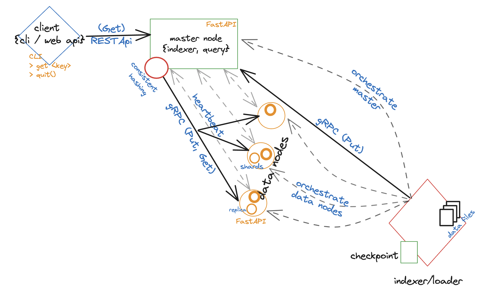

# sdnuobretuo_KV_assignment

####  A Scalable, fault-tolerant KV store for immutable data

**Context**: As described in [systems-assignment](https://github.com/savingoyal/systems-assignment/tree/main?tab=readme-ov-file) problem statement, this repository contains an implementation of a `Key-Value Database`, that hosts KV pairs of immutable data, and by the virtue of being a *Distributed KV Store*, stays: 
- **scalable**(Volume of KV rows),\
_Capability_ -> As a minimal-viable capability, the KV Store System, designed as a master/slave(Data Node) architecture, operates with N datanodes that can be tweaked/configurable, albeit requiring a startup all-over.\
_Ideas for Extension_ ->  \
Scaling Master/Query Node:\
a. Stateless-(Auto:AWS) An [ALB](https://docs.aws.amazon.com/elasticloadbalancing/latest/application/introduction.html) atop bunch of 'master' (doing the role of `Query Nodes`) is a possibility. Master/Query Nodes are further tied to an AutoScalingGroup [ASG](https://docs.aws.amazon.com/autoscaling/ec2/userguide/auto-scaling-groups.html). It'd be better to keep in-memory caches in a "Centralized Cache/Repo/Store", unless a [sticky Session](https://stackoverflow.com/a/13641836/3356424)/IP-/Key- hash based request routing (from LB -> Master) like coupling is ensured. \
b. Stateless-(Auto:K8s) A HorizontalPodAutoscaler i.e [HPA](https://kubernetes.io/docs/tasks/run-application/horizontal-pod-autoscale/) to scale in/out pods within specified min- and max- replicas(scale in/out), and a VerticalPodAutoScaler i,e `VPA` for scaling up/down. Little effective for merely connection pool and in-memory caches(this further needs 'sticky-session' kind of setup b/w master-svc and pods). What may still FWIW be even more rewarding is a [Multidimensional Pod Autoscaling](https://cloud.google.com/kubernetes-engine/docs/how-to/multidimensional-pod-autoscaling) : horizontally w.r.t CPU, vertically w.r.t Memory. \ 
c. Stateless-(Scaling) A [Replica Set](https://kubernetes.io/docs/concepts/workloads/controllers/replicaset/) for master nodes, or specified number of replicas in the [Deployment](https://kubernetes.io/docs/concepts/workloads/controllers/deployment/). \
d. Stateful-(Replicated [StatefulSets](https://kubernetes.io/docs/concepts/workloads/controllers/statefulset/)) it runs a group of Pods, maintaining a sticky identity. Management is a bit complicated, w.r.t LCM of PV/PVCs, graceful deletion. \
- Scaling DataNodes:\
a. Stateful(recommended)- A StatefulSet for each of N DataNodes/replicas, wherein each DN has a Persistent Storage(using [PVC](https://kubernetes.io/docs/concepts/storage/persistent-volumes/)).\
b. Stateless- If storage can be 'delegated' to a NFS(Network FileSystem) or an [Object-Store](https://min.io/), e.g [AWS S3](https://aws.amazon.com/blogs/big-data/get-started-managing-partitions-for-amazon-s3-tables-backed-by-the-aws-glue-data-catalog/), e.g `keyspace=<>/shard=<>`, DNs go 'state-less'(barring the in-memory cache) and can be scaled just as Masternode. However, Network I/O, latency, increases big time, compared to a 'co-located' compute and storage, besides the storage/persistence mode now moved to disk/FS instead of in-memory/RAM-lookup, which is undesired. \ 

- **Available**(achieved for Data/Nodes using sharding and replication) \
_Capability_ -> A minimal, decoupled with nodes, capability around availability of data. Data is broken into shards (Data furthermore is clubbed as/into Keyspaces), such that a node going down doesn't impact availability of the contained shards, recoverable from nodes containing their replicas, and are thereafter, resharded onto/amongst available nodes.\
_Ideas for Extension_ -> 
a. achieve 'High Availability' around 'master node' by either implementing Cassandra-like 'Gossip Protocol', eradicating need for a Master Node as [SPoF](https://en.wikipedia.org/wiki/Single_point_of_failure) but at the cost of eventual consistency, complexity. Alternatively, there can be concepts like a [multi-master mode](https://docs.aws.amazon.com/emr/latest/ManagementGuide/emr-plan-ha-launch.html) (e.g in AWS EMR), or a [SecondaryMasterNode](https://stackoverflow.com/questions/19970461/name-node-vs-secondary-name-node) largely designed to be the 'failover' of MasterNode, e.g in Hadoop.


- *"fault tolerant"*- breaking Data into 'shards' that are 'replicated', thereby, despite any datanode failing, the master node can accomplish re-sharding, further augmented by: \
_Capability_ -> \
a. Sharding and replication, is further 'de-coupled' from data nodes, achieved by 'Consitent Hashing', wherein Virtual Nodes are mapped to datanodes, whose downtimes only require affected VNodes to be only moved/re-hashed/sharded.\
b. Safety and Liveness- ensured by 'health checks' conducted over gRPC by Master Node, every N seconds. \
_Ideas for Extension_ -> \
a. Leader Election, vis-a-vis replicas of the primary shards 'lost' may now be 'elected' as primary shards. \
b. Only-Readability till re-sharding settles down- akin to RED/YELLOW/GREEN Cluster Health statuses of ElasticSearch. Our Implementation is akin to Elastic-search w.r.t Master Node, Data Nodes
Fault Tolerance, fuels (High)Availability described above, and are somewhere related.

- *"low-latency"* look-up: \
_Capability_-> \
(Efficient Routing and Retrieval)- the 'data loader' indexes Key-Values basis the key hash, into a mapped shard, which the Master Node via, Consistent Hashing, maintains and quickly looks up during retrieval. \
_Ideas for Extension_ -> \
Basis the load at present at the nodes, and furthermore, when "data" maybe subject to "mutations", the replicas may be pegged to answer any retrieval queries. 

- *Durability*: \
_Ideas for Extension_: we may implement: \
a. Shard Size/number per keyspace best practices, just like Elasticsearch indexes settings. \
b. Disk Spills(specialised DSes like MemTable -> SSTables -> LSM(Merge/Compaction e.g in *RockDB* is a better bet): E.g 'overflowing' shards may be allowed to spill further records into disks, as a tradeoff to cost-savviness(or resource constrainrs) v/s latency. 

Furthermore, it incorporates some other good-to-have capabilities as following practices:

#### Data Load:
-> Data Load/Indexing with Checkpointing: File(s) are read as 'chunks' of N rows each.  \
-> Data Load/Indexing with speed and memory optimization: furthermore processed 'parallely' using multiprocessing in Python.\
-> (Atleast-Once) Data Load Semantics: The chunk_ids are 'checkpointed' only after successful processing. Additionally, for ingestions 'outside' of a file upload using this 'loader', we may encourage indexing/master nodes to use [WAL](https://en.wikipedia.org/wiki/Write-ahead_logging) for K-V pairs published by 'producers'. WAL can be replayed in tandem with its corresponding checkpoint. \

#### Data Persistence:
-> Routing: UUID4 Keys are hashed and mapped accordingly into similar shards, which are maintained using Consistent Hashing Ring and easily looked up by Master Node during Retrieval.\
-> Transport: using GRPC atop Protobufs, allows lesser network I/O, latency, as a choice for high-performance applications.

#### Implementation:
-> Modularity- Code Impl has been segregated into respective modules/packages e.g for grpc, system(data/ and master/ nodes), client packages (implemented as a nice, [redis like](https://redis.io/docs/latest/develop/connect/cli/) cli!) \
-> Configuration- Information about configurables e.g Num of Nodes, Virtual Nodes, Replication Factors, HEARTBEAT INTERVAL etc. is kept as a single source of reference inside `config` package. \
-> OOP&D and S.O.L.I,.D Principles- Dependency Injections of Chunk Processor, CheckPointing etc. into KV Store Loader/Warmer. \
-> Separation of Concerns- While K8s manifests/deployment Yamls would have been an awesome overengineering, we settled with atleast a VirtualEnv.

## Design & Arch.:
Overall, the design of this implementation, is highly inspired from: 
- [Elasticsearch](https://www.elastic.co/elasticsearch), w.r.t how various components work in tandem, vis-a-vis master, datanodes etc.(there was also scope for Indexer Node)
- [Redis](https://redis.io/), famous KV Cache/Store esp. w.r.t client cli.
- [k8s](https://kubernetes.io/), [microservices](https://microservices.io/), esp. w.r.t how various services e.g Master, DataNodes communicate, do liveliness Probes/HealthChecks etc., using [gRPC](https://grpc.io/)(atop HTTP/2 using Proto).  



## SetUp and Run:
Requisites:
- preferably unix-OS like MacOS, Ubuntu.
- python3 installed, preferably >=python3.10
- `git`, `virtualenv` should be installed.

Install Env:
```shell
pushd `pwd`
git clone git@github.com:bohemia420/sdnuobretuo_KV_assignment.git
cd sdnuobretuo_KV_assignment
python3.10 -m venv .venv_311
source .venv_311/bin/activate
pip install -r my_immutable_KV_store/requirements.txt
deactivate
popd
```

__For Starting the KV Store Up:__
```shell
pushd `pwd`
cd <path-to-repo>
source .venv_311/bin/activate
pip install -r requirements.txt
export PYTHONPATH=$PYTHONPATH:`pwd`
python my_immutable_KV_store/src/my_immutable_kv_store/my_imm_kv_store.py --data data --clear
popd
```
This should show up something like below:


__For using the Client KV Cli:__
```shell
cd <path-to-repo>
source .venv_311/bin/activate
export PYTHONPATH=$PYTHONPATH:`pwd`
python my_immutable_KV_store/src/my_immutable_kv_store/my_imm_kv_store.py
```
This should show up a CLI like below:


## FAQs:
- How much data can your server handle? How could you improve it so it can handle even larger datasets? \
_Ans_: The approach, if combined with:
1. An AutoScaling aspect, either an ASG or HPA, VPA (best of both worlds). 
2. Faster, parallel writes, asynchronous reads/request handling.
3. Capabilities to Disk Spills. DN Memory may have to be mapped to keep `executor-memory`(for load-able shards), `buffer`(for loading subset of shard likely to contain the key, i.e 'page' the offline-shard load) \
4. extremely large datasets might want this to become an 'embedded Key-Value' Store like [RocksDB](https://github.com/facebook/rocksdb), such that data now lies on flash drives/SSDs. This shall need an implementation of *Log-Structured-Merge-Database* **(LSM)** off SSTables and BloomFilters. \
Can be almost scalable limitlessly, however, each power coming with a clause:
1. ASG needs lighter AMIs, HPA/VPA(may lead to/accompanied with cluster autoscaling) may have but, an increased latency/draining. \
2. Would certainly need an 'Indexer' Node, in addition to master node, require config around CHUNKSIZE etc to be tweaked accordingly. \
3. Convincingly increases the latency. \
However, as a back of the envelope, given each KV is not beyond 1KB, a single node [R5.2xlarge](https://aws.amazon.com/ec2/instance-types/r5/) equivalent Local Machine can accommodate ~50M KV pairs.\
Scaling it out further, with right instance type choices, configuration adjustments, should be able to provide an Industry-standard S.L.A

- How many milliseconds it takes for the client to get a response on average? How could you improve the latency? \
_Ans_: It is taking roughly **~10-15msecs**(warm up/1st call up takes _20-30msecs_), albeit this KV Store implementation has not been "load tested" to get to stats around mean, median, p90, p99 etc. \
The cached calls, however, wind up within **4-8msecs**. \
The Latency can be improved, further as: \
-> [Done] introduced Cacheing Layers(latency down to <10msecs, both at MasterNode as well as DataNodes(they keep it all in memory but have to look up further into shards).\
-> leveraging replicas esp when primary shards may also withstand extensive 'writes'.\
-> trying not to "spill" the overflowing KV rows into 'disk'. \
-> Dictionaries are bound to give O(NlogN) where N is number of Keys, as these are [Weight-Balanced Trees](https://en.wikipedia.org/wiki/Red%E2%80%93black_tree) underneath. \
-> Mitigating 'Network I/O' as much as possible. DataNode(s) and MasterNodes can be colocated from anywhere being in same rack to atleast same [AZ](https://docs.aws.amazon.com/AWSEC2/latest/UserGuide/using-regions-availability-zones.html), or Region. \
-> Better tech stack of implementation, e.g a Low Level Language like C++ (that also has Redis, Algolia, SkyllaDB etc. all implemented in). Python as a high-level is anyways not a good choice thanks to GIL aching concurrency (FastAPI with asynchronous Startlette/Waitress is albeit good enough). Java can give better mileage, far as immutability is assured- GC overheads are otherwise problematic! \
-> [Done] We already did "Keyspacing". This means, smaller/relevant shards referenced as sub-keys in the storage map of the DN. \
-> [Done] We already did "gRPC" over HTTP/2 using Protobufs.We further, maintain gRPC Connection Pools in the master node(s), as alluded to, below. \
-> [Done] Use a gRPC channel pool against respective data_node, this must however be properly 'LifeCycleManaged', i.e when datanode goes down / new added. \ 
-> [Done] We already used keep-alive setting of 60secs at server(FastAPI) level- albeit marginal improvement. Also had a 'global' masternode grpc channel/stub. \ 
-> Avoiding Anti-Patterns e.g RF = Num of Nodes because cluster shall be, esp when records are mutable, simply always getting the cluster 'consistent'- lots of Network I/O.

- What are some failure patterns that you can anticipate? \
_Ans_:
1. Out Of Memory Errors- if data to be served is huge, doesnt fit in RAM constraints of datanodes, and disk spill isn't viable(or LevelDB like implementation for both RAM(MemTable) and Flash(SSTables, LSM), then OOMs shall haunt us during data load/KV Store warm up.
2. Scaling "up" i.e VPA may need K8s cluster node to be compliant/well-configured to accomadate DN pod after (vertical) autoscaling.
3. Possible failures by virtue of scaling in/out, as the node maybe drained- maybe more pronounced during VPA.
3. Node failures- resharding may be a time-taking process, albeit reads(only) should still be admissible
3. Hash Collisions, are but very unlikely. 
4. We mitigated failures that indexing could have caused. Albeit, it will be better to have and use integrations to Distributed Data Processing frameworks e.g Spark, Hadoop that can "better" Bulk Index the KV Records, e.g [Spark-ES Connector](https://discuss.elastic.co/t/connector-for-elastic-search-8-6-2-and-databricks-spark-3-4-0/342746). 


